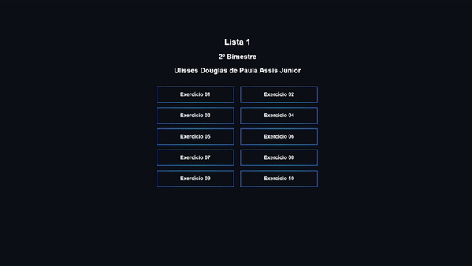
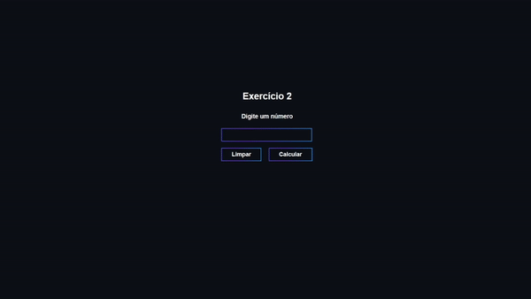
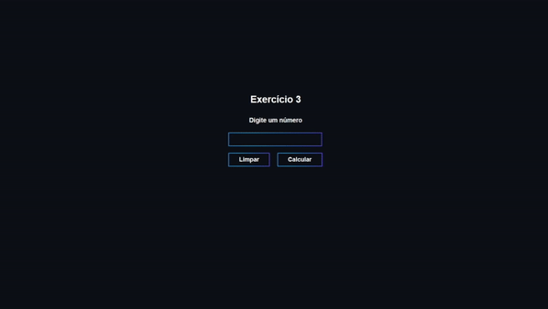
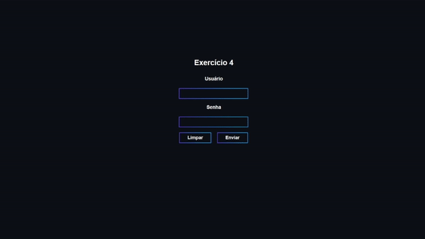
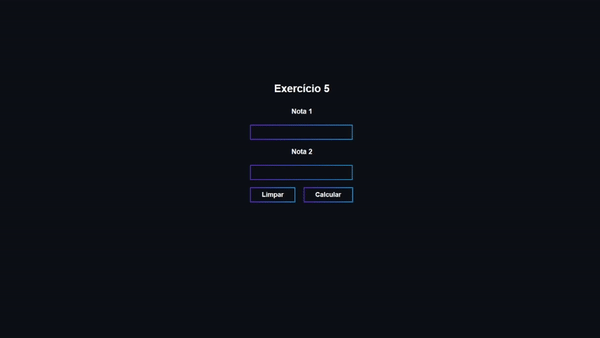
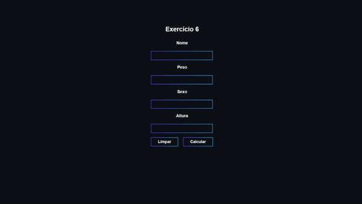
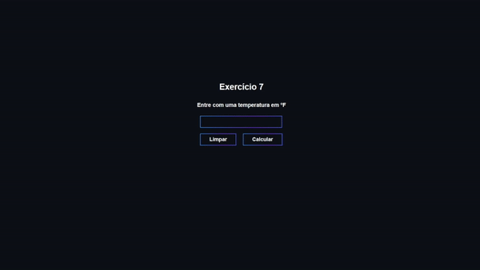
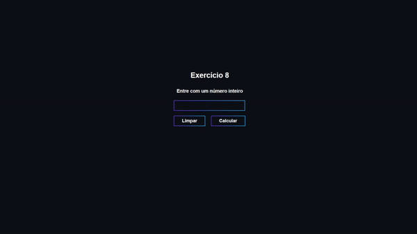
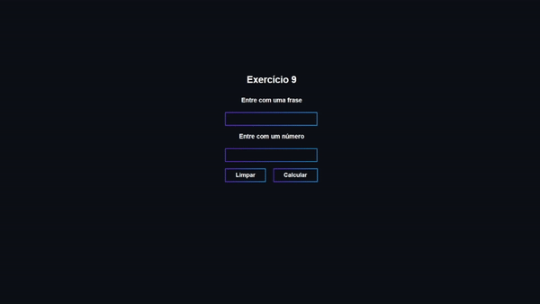
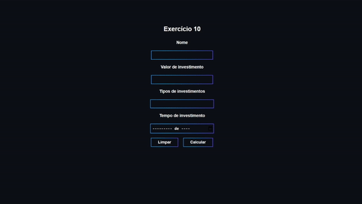

# Form_PHP-1
Meu segundo bimestre trabalhando com PHP, esse arquivo é a primeira lista do bimestre sobre o assunto (2ºBimestre/2021)

  
## Exercício 1
No HTML: Recebe o valor da compra do usuário. 
 
No PHP: Se o valor informado for >= 100, será emitida a mensagem "Compra maior ou igual a cem", caso contrário nada acontece.

  
## Exercício 2
No HTML: Recebe um número da escolha do usuário. 
 
No PHP: Se o número informado for >0, será emitida uma mensagem em azul "Número Positivo", se o número informado for <0, será emitida uma mensagem em vermelho "Número Negativo".

  
## Exercício 3
No HTML: Recebe um número da escolha do usuário. 
 
No PHP: Se o número informado for divisível por 2 e tenha resto 0, será emitida a mensagem "Par", caso contrário será emitida a mensagem "Ímpar".

  
## Exercício 4
No HTML: Recebe o nome e senha do usuário. 
 
No PHP: Se o nome for "unesp" e a senha for "cotec", será emitida a mensagem "Seja bem vindo ao Sistema de Ativação", caso contrário será emitida a mensagem "Usuário ou Senha inválidos!!! Tente novamente!!!".

  
## Exercício 5
No HTML: Recebe a Nota 1 e a Nota 2 do usuário. 
 
No PHP: Se a média ($nota1/2 + $nota2/2 = $resultado) for >=8, será emitida a mensagem "Aprovado", se for <=3, será emitida a mensagem "Reprovado", caso contrário será emitida a mensagem "Recuperação".

## Exercício 6
No HTML: Recebe o nome, peso, sexo e altura do usuário. 
 
No PHP: Se o usuário for do sexo masculino, é utilizado a fórmula $pi=pow($altura,2)*23, se o usuário for do sexo feminino, é utilizado a fórmula $pi=pow($altura,2)*22.
Se o $peso>$pi, será emitida uma mensagem em vermelho "Você está acima do peso ideal", se o $peso==$pi, será emitida uma mensagem em azul "Você está Você está dentro do peso ideal", Se o $peso<$pi, será emitida uma mensagem em amarelo "Você está abaixo do peso ideal".

## Exercício 7
No HTML: Recebe uma temperatura em ºF do usuário. 
 
No PHP: Converte o número informado e seus 10 sucessores em ºC, utilizando a fórmula $r=($temp-32)*5/9.

  
## Exercício 8
No HTML: Recebe um valor aleatório do usuário. 
 
No PHP: Converte o número informado e seus 20 sucessores em raiz quadrada.

  
## Exercício 9
No HTML: Recebe uma frase e um número do usuário. 
 
No PHP: Faz uma tabela, onde o número do colunas é = ao número informado pelo usuário, em cada tabela a frase se repetirá.

  
## Exercício 10
No HTML: Recebe o nome, valor de investimento, tipo de investimento e tempo de investimento do usuário. 
 
No PHP: Faz uma tabela, informando a rentabilidade do dinheiro a cada tempo informado pelo usuário. 

